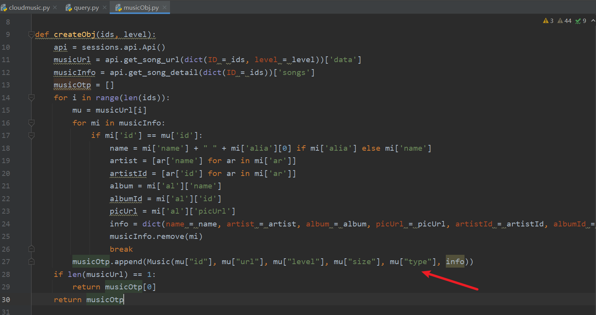
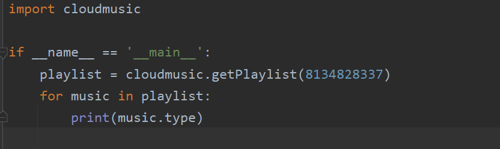
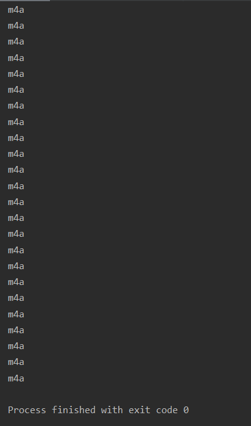
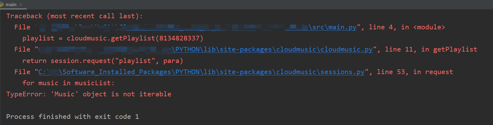
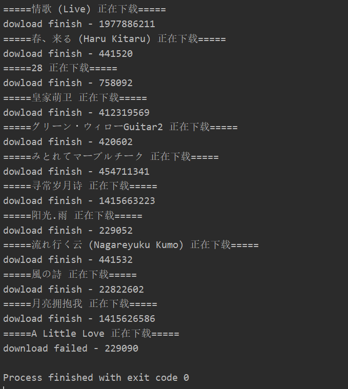
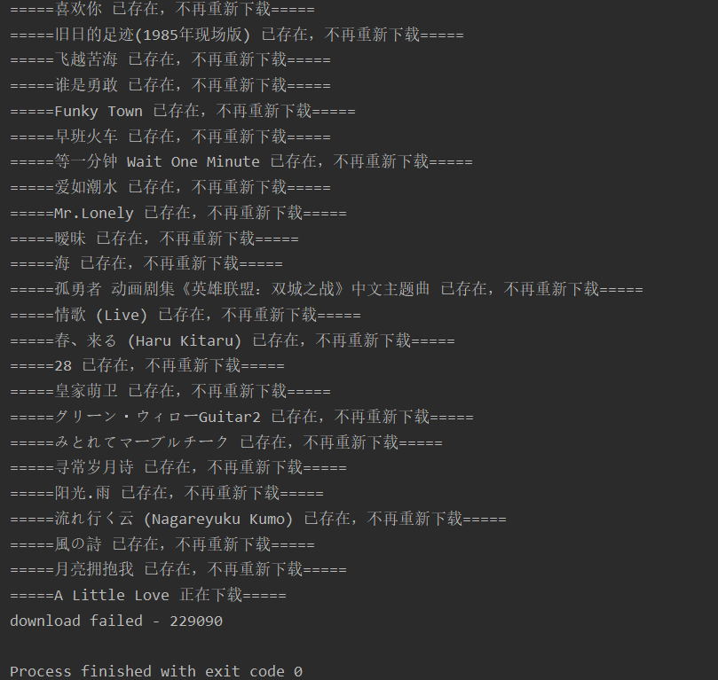

## cloudmusic 【enhance】

原python库：https://github.com/p697/cloudmusic

补充特性：

- 添加功能：不重复下载

### 说明

存在的问题：每次获取的音乐对应类型，可能会发生改变。

### 代码示例

根据一个歌单id，获取歌单里所有的歌曲信息。

运行结果一

运行结果二

运行结果三

### 该项目做的事情

每次下载前，获取下载目录的所有文件名，将其拼接成字符串。

通过正则表达式，判断用户曾经是否下载过某一个文件。

### 截图

第一次下载

第二次下载

### 补充

该项目依赖 原python库，在 pycharm 中可以直接 下载依赖。

- 也可以通过命令：`pip install cloudmusic`

原项目中有时运行会出现错误提示 `TypeError: 'Music' object is not iterable`， 重新运行程序即可。

